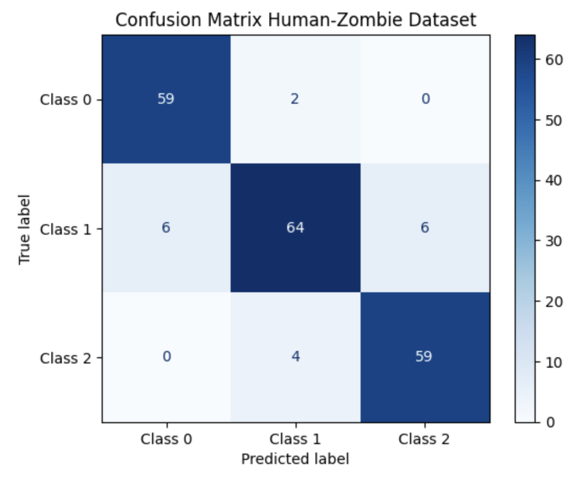

# Hi, I'm Haris! 👋

[](https://choosealicense.com/licenses/mit/) 

# Logistic Regression

The repository contains the following files:

* **LogisticRegression.ipynb** – contains code for training and evaluating the logistic regression model
* **LogisticRegression.py** – corresponding .py file for the Logistic Regression Jupyter Notebook
* **human_zombie_dataset_v5.csv** – contains the dataset required for the model
* **human_zombie_dataset_v5.xlsx** – corresponding Excel file for easier visualization <br>

## Table of Contents

1. [Introduction](#introduction)
2. [Installation Requirements](#installation-requirements)
3. [Assignment Overview](#assignment-overview)
4. [Data](#data)
5. [Training and Evaluation](#training-and-visualization)
6. [Screenshots](#screenshots)
   
## Introduction

This assignment focuses on the implementation and evaluation of **Logistic Regression**, a fundamental algorithm used for **binary classification** tasks. Unlike linear regression, which predicts continuous outcomes, logistic regression estimates the **probability of a class label** using the sigmoid (logistic) function to map linear combinations of features to values between 0 and 1. This makes it ideal for problems where the output is categorical — typically **0 or 1**.

In this project, we apply logistic regression to the **`human_zombie_dataset_v5`**, a synthetic dataset designed to model and classify regions or scenarios based on zombie-related features. 


## Installation Requirements

To run the notebooks in this repository, you will need the following packages:


!pip install idx2numpy

* `numpy`
* `pandas`
* `matplotlib`
* `scikit-learn`


You can install these packages using pip:

```bash
pip install numpy
```

```bash
pip install pandas
```

```bash
pip install matplotlib
```

```bash
pip install scikit-learn
```

After installing the required libraries, run the **"Imports"** cell in the notebook to begin.

Useful Links for installing Jupyter Notebook:
- https://youtube.com/watch?v=K0B2P1Zpdqs  (MacOS)
- https://www.youtube.com/watch?v=9V7AoX0TvSM (Windows)

It's recommended to run this notebook in a conda environment to avoid dependency conflicts and to ensure smooth execution.
Also, you will need a GPU to run the notebooks. It is recommended to have a Google Colab Account (perhaps multiple accounts) for this purpose.
<h4> Conda Environment Setup </h4>
<ul> 
   <li> Install conda </li>
   <li> Open a terminal/command prompt window in the assignment folder. </li>
   <li> Run the following command to create an isolated conda environment titled AI_env with the required packages installed: conda env create -f environment.yml </li>
   <li> Open or restart your Jupyter Notebook server or VSCode to select this environment as the kernel for your notebook. </li>
   <li> Verify the installation by running: conda list -n AI_env </li>
   <li> Install conda </li>
</ul>


## Assignment Overview

The `LogisticRegression.ipynb` notebook provides a comprehensive exploration of **logistic regression** as a binary classification algorithm, using both manual implementation and scikit-learn's built-in tools.

### 1. **Logistic Regression from Scratch**

The notebook begins with an implementation of logistic regression **from the ground up** using only `NumPy`.  <br>
This part strengthens the mathematical intuition behind logistic regression and gives full control over the learning process.

### 2. **Logistic Regression using Scikit-learn**

Next, the same classification task is approached using the `LogisticRegression` class from `scikit-learn`. This includes:

This section helps contrast manual implementation with real-world libraries that are optimized for performance and ease of use.

### 3. **Model Evaluation and Interpretation**

The notebook concludes with visual and quantitative analysis.


## Data

The dataset used in this assignment is titled human_zombie_dataset_v5.csv, a creatively themed, synthetic dataset. This dataset simulates human and zombie characteristics based on various lifestyle and physical traits. The dataset contains 1,000 entries, each with features that correlate with a continuous "Human-Zombie Score" ranging from 0 (complete human) to 100 (complete zombie).

**Features**

- **Height (cm):** The height of the individual measured in centimeters, it decreases with zombie score because zombies are known to shrink in height.

- **Weight (kg):** The weight of the individual measured in kilograms. Zombies tend to have a lower weight because of loss of muscle mass, tissue, organs (and soul??).

- **Screen Time (hrs):** The average number of hours spent in front of screens daily. This feature increases with the human-zombie score, reflecting a more sedentary lifestyle.

- **Junk Food (days/week):** The average number of days per week the individual consumes junk food. This feature also increases with the human-zombie score, indicating poorer dietary habits.

- **Physical Activity (hrs/week):** The total hours spent on physical activities per week. This feature decreases as the human-zombie score increases, suggesting a decline in physical activity.

- **Task Completion (scale):** Scale from 0 to 10 representing how often tasks are completed on time (0 = always on time, 10 = never on time). This score decreases with a higher human-zombie score, indicating declining productivity.

- **Human-Zombie Score:** A continuous score from 0 to 100 representing the degree of "zombie-ness" of the individual, where 0 is fully human and 100 is completely zombie-like.

## Training and Visualization

The entire training process alongside the relevant evaluations and visualizations are explained in detail in the jupyter notebook. 

## Screenshots

<h4> 1. This image shows how Ridge Regression shrinks the coefficients of all features as regularization strength increases. In Ridge regression, all coefficients shrink smoothly toward zero as log(Alpha) increases. Unlike Lasso, Ridge never eliminates features entirely — it reduces their influence proportionally.  </h4>
 <br> 

 
## License

[MIT](https://choosealicense.com/licenses/mit/)


